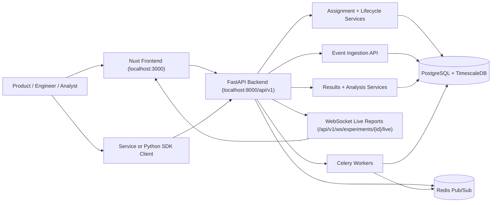

# Litmus Platform

A/B Testing & Experimentation Platform — enterprise-grade patterns.

## Overview

Litmus is a full-stack experimentation platform for running A/B tests, A/B/n tests, and multi-armed bandit experiments with real-time analytics and statistical rigor.

## Features

- **Experiment Management** — Create, configure, and manage A/B and multivariate experiments
- **Traffic Allocation** — Flexible traffic splitting with percentage-based controls
- **User Assignment** — Thompson Sampling adaptive assignment with live posterior diagnostics
- **Event Tracking** — High-throughput event ingestion with TimescaleDB
- **Real-time Dashboard** — Live metrics via WebSocket + Redis Pub/Sub
- **Statistical Analysis** — T-tests, chi-squared tests, confidence intervals
- **Multi-armed Bandits** — Thompson Sampling, UCB, Epsilon-Greedy algorithms
- **Auto-insights** — Automated anomaly detection and recommendations

## Tech Stack

| Layer | Technology |
|-------|------------|
| Frontend | Nuxt 3 (Vue 3 + Nitro) |
| Backend | FastAPI, WebSockets |
| Database | PostgreSQL + TimescaleDB |
| Cache & Pub/Sub | Redis |
| Task Queue | Celery |
| Statistics | scipy, statsmodels |
| Containerization | Docker Compose |

## Project Structure

```
litmus-platform/
├── frontend/           # Nuxt 3 application
│   ├── pages/          # File-based routes
│   ├── composables/    # API/data hooks
│   ├── assets/         # Styling and static assets
│   ├── types/          # Shared TypeScript types
│   └── nuxt.config.ts  # Runtime/frontend config
│
├── backend/            # FastAPI application
│   └── app/
│       ├── api/        # REST & WebSocket endpoints
│       ├── core/       # Business logic (assignment, statistics, bandits)
│       ├── models/     # SQLAlchemy models
│       ├── schemas/    # Pydantic schemas
│       ├── services/   # Service layer
│       ├── workers/    # Celery tasks
│       └── db/         # Database utilities
│
├── sdk/                # Client SDKs
│   └── python/         # Python SDK
│
└── scripts/            # Utility scripts
```

## Architecture



Data flow summary:
- Experiment setup and lifecycle controls flow through frontend/SDK to backend experiment APIs.
- Assignment requests return deterministic variant decisions from backend services.
- Exposure, metric, and conversion events are ingested by backend and persisted in PostgreSQL/TimescaleDB.
- Results/analysis endpoints compute lift, confidence, and bandit diagnostics from stored events.
- Live updates are available via websocket report stream and near real-time polling in dashboard pages.

## Tutorials

Quickstart and role-based docs:
- Self-serve quickstart: `docs/runbooks/self-serve-quickstart.md`
- Product/owner playbook: `docs/runbooks/product-experiment-owner-playbook.md`
- Engineer integration playbook: `docs/runbooks/engineer-integration-playbook.md`
- Analyst decisioning playbook: `docs/runbooks/analyst-results-playbook.md`
- Variant-only + controlled stop: `docs/runbooks/variant-only-stop-playbook.md`
- Five-model live bandit tutorial: `docs/runbooks/live-bandit-5-model-tutorial.md`

## Run The App (Docker Compose)

You can run the full stack and preview the UI now:

```bash
docker compose up --build
```

Endpoints:
- Frontend UI: `http://localhost:3000`
- Backend API: `http://localhost:8000`
- Health: `http://localhost:8000/health`
- Readiness: `http://localhost:8000/ready`
- Metrics: `http://localhost:8000/metrics`

Frontend runtime config:
- `NUXT_PUBLIC_API_BASE` (default: `http://localhost:8000/api/v1`)

## Smoke Test (Self-Serve Flow)

After services are up, validate full lifecycle with:

```bash
python3 scripts/smoke_self_serve.py --base-url http://localhost:8000
```

If write tokens are enabled, pass one:

```bash
python3 scripts/smoke_self_serve.py --base-url http://localhost:8000 --token <admin-token>
```

The smoke flow covers:
- health/readiness checks
- experiment creation + launch
- deterministic assignment request
- exposure + metric ingestion
- results retrieval
- pause + stop lifecycle actions

## Live Bandit Tutorial Flow

Run end-to-end five-model simulation and observe live convergence:

```bash
python3 scripts/live_bandit_simulation.py --base-url http://localhost:8000
```

The script prints:
- experiment URLs for detail/results dashboard pages
- periodic live bandit snapshots (top variant, win probability, exposures)
- convergence signal and manual kill instructions (`stop`)

## Python SDK Quickstart

```python
from litmus import ExperimentClient

client = ExperimentClient(
    base_url="http://localhost:8000",
    api_key="dev-token",
    timeout=5,
    retries=2,
    cache_ttl_seconds=30,
    fail_safe_enabled=True,
)

assignment = client.get_variant(
    experiment_id="suggested_order_v4",
    unit_id="store-123",
    attributes={"country": "CA"},
)

if assignment.variant_key == "treatment":
    pass  # run treatment path
else:
    pass  # run control path

client.log_exposure("suggested_order_v4", "store-123", assignment.variant_key)
client.log_metric("suggested_order_v4", "store-123", assignment.variant_key, "order_value", 1250.30)
client.flush()
```

Behavior notes:
- `get_variant` caches assignments in-memory for the configured TTL.
- transient backend errors are retried (`retries`).
- when backend is unavailable, fail-safe mode returns a configurable control variant.
- event logging is buffered and flushed either automatically at `batch_size` or via `flush()`.

## License

See [LICENSE](./LICENSE) for details.
