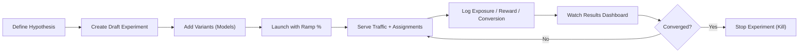
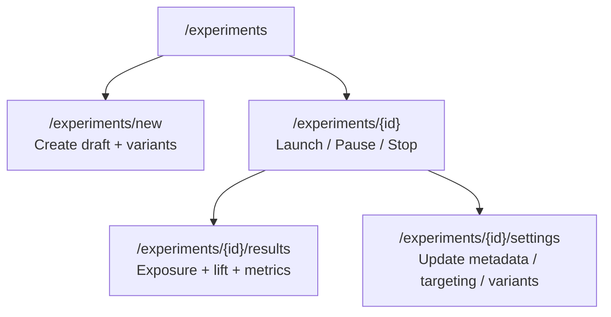
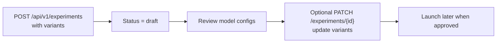

# Data Scientist Visual Onboarding

This is a visual guide for running Litmus without reading backend code.

## 1. End-to-End Picture



## 2. Screen Map (Where to Click)



## 3. What You Should See At Each Step

### A) Create Draft + Variants (`/experiments/new`)
- Required fields: name, description, owner team.
- Variants section with keys like `model_a`, `model_b`, ...
- Weights must sum to `1.0`.
- Draft can be saved without launch.

### B) Launch (`/experiments/{id}`)
- Status changes from `DRAFT` to `RUNNING`.
- Ramp control lets you set traffic fraction.
- Buttons available: `Launch / Update Ramp`, `Pause`, `Stop`.

### C) Observe (`/experiments/{id}/results`)
- Exposure totals bars move as events arrive.
- Metric summaries show `count` and `mean`.
- Lift table shows control vs treatment stats.

### D) Convergence + Kill
- In terminal (bandit simulator), watch `live_snapshot` and `converged` logs.
- In UI, stop via `Stop` button on detail page.
- API equivalent: `POST /api/v1/experiments/{id}/stop`.

## 4. Create Variants Only (No Launch Yet)



Key point:
- There is no separate endpoint named "create variant".
- Variants are created or replaced through experiment create/patch payloads.

## 5. Live Bandit Visual Loop (5 Models)

Use:

```bash
python3 scripts/live_bandit_simulation.py --base-url http://localhost:8000
```

Then track two views in parallel:
- UI results page (`/experiments/{id}/results`) for visible aggregates.
- terminal `live_snapshot` output for top variant, win probability, and exposures.

When convergence is reached, manually kill in UI or via API.

## 6. If Something Looks Wrong
- No exposure movement: confirm assignment and `/events/exposure` logging.
- No metric movement: confirm `/events/metric` payloads.
- No conversion signal: confirm `/events` conversion writes for simulation/tutorial flows.
- API/auth errors: verify `ADMIN_API_TOKENS` and bearer token usage.
